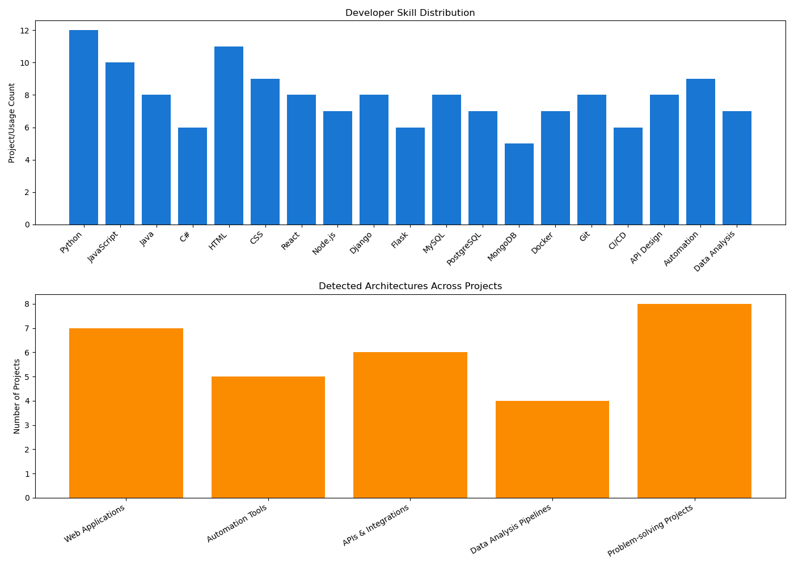

# Hi there, I'm Morley Mujansi 👋

Welcome to my GitHub profile! I'm passionate about technology, problem-solving, and continuous learning. Although most of my repositories are private, I'm eager to share the skills and the types of projects I work on, along with the impact they've had.

---

## 🛠️ Skills & Technologies

- **Programming Languages:** Python, JavaScript, Java, C#
- **Web Development:** HTML, CSS, React, Node.js, Django, Flask
- **Databases:** MySQL, PostgreSQL, MongoDB
- **Cloud/DevOps:** Git, Docker, CI/CD
- **Other:** API Design, Automation, Data Analysis

---

## 💡 Featured Project Types

While the specifics are private, here's an overview of what I build and the kinds of problems I solve:

- **Web Applications:**  
  Designed and developed responsive web solutions for businesses and startups, improving process automation and user engagement.

- **Automation Tools:**  
  Created automation scripts and tools to eliminate repetitive manual tasks, saving valuable time and reducing errors.

- **APIs & Integrations:**  
  Built robust APIs for seamless communication between different systems—solving integration challenges in diverse environments.

- **Data Analysis Pipelines:**  
  Developed data handling pipelines to help businesses extract actionable insights from raw data.

- **Problem-solving Projects:**  
  Tackled unique business and technical challenges with creative, scalable solutions.

---

## 🌱 About Me

I'm always eager to take on new challenges and learn new technologies. If you'd like to connect or learn more about my experience, feel free to reach out!

---

*Thanks for visiting my profile!*
